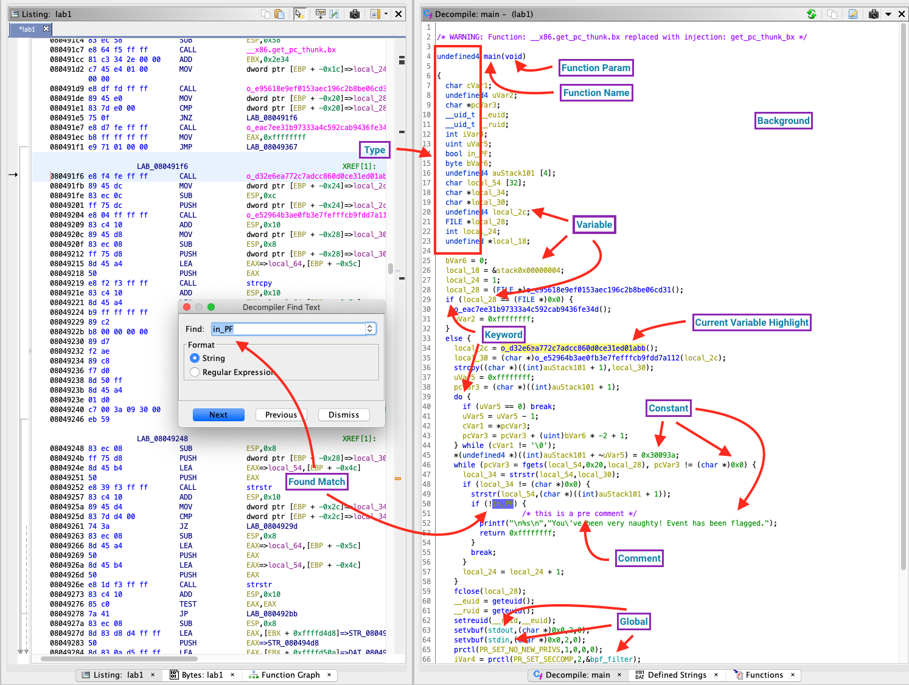
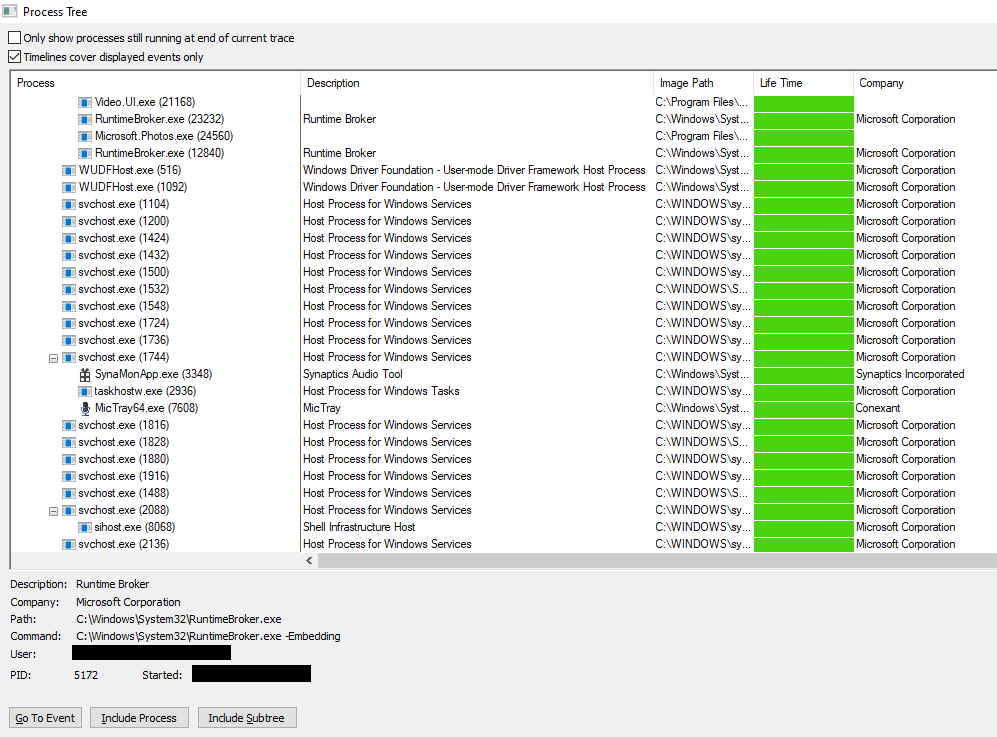
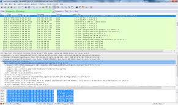
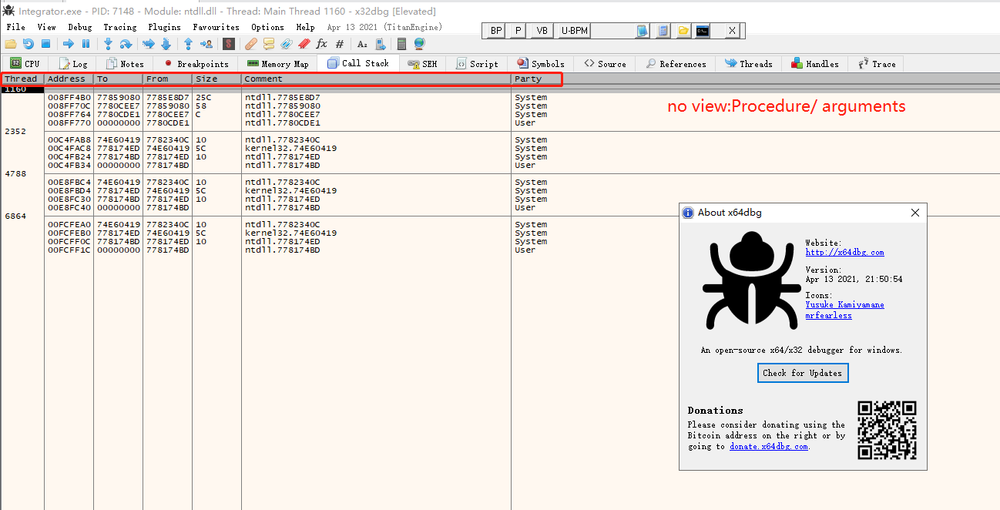

# Rapport — Reverse engineering (logiciels)

Date : 17/02/2026  
Contexte : Stage (notes de synthèse)  

## En bref
Le reverse engineering (RE) c’est **comprendre un logiciel qui existe déjà**, souvent quand on n’a pas le code source.

Deux façons de travailler :
- **Statique** : on analyse *sans exécuter* (on lit la structure, les fonctions, les chaînes de caractères…).
- **Dynamique** : on analyse *en exécutant* dans un environnement contrôlé (on observe fichiers, réseau, appels système…).

Point important : on le fait **avec autorisation** (logiciel interne, labo, accord explicite, open‑source) et on documente ce qu’on voit.

## 1) C’est quoi, et pourquoi on le fait en cybersécurité
Le reverse engineering consiste à analyser un fichier (EXE/DLL, script, application mobile, firmware, format de fichier, protocole réseau) pour répondre à des questions simples :
- Qu’est‑ce que ça fait ?
- Qu’est‑ce que ça lit/écrit ?
- Est‑ce que ça communique sur le réseau ?
- Quelles fonctions sont “sensibles” (crypto, parsing, authentification…) ?

Exemples d’objectifs (légitimes) :
- **Comprendre** un programme (incident, reprise de projet, logiciel sans doc).
- **Auditer** (détecter des comportements risqués, des vulnérabilités).
- **Interopérer** (documenter un format/protocole pour construire un outil compatible).
- **Forensic / réponse à incident** (comprendre une exécution, repérer des IOC).

## 2) Ce qu’on peut reverse (et ce que ça change)
La cible influence la méthode et les outils :
- **Windows** : EXE/DLL (format **PE**).
- **Linux** : binaires (format **ELF**).
- **Mobile** : APK (Android), IPA (iOS), souvent avec obfuscation.
- **Firmware / IoT** : architectures ARM/MIPS, systèmes de fichiers embarqués.
- **Protocoles / formats** : on cherche la structure des messages (champs, tailles, encodage, checksum, etc.).

## 3) Méthode simple (procédé)
L’idée n’est pas de tout comprendre d’un coup. On avance par étapes : **hypothèse → preuve → conclusion**.

### Étape A — Triage (se faire une idée rapide)
Objectif : savoir “à quoi on a affaire”.
- Type de fichier, architecture (x86/x64/ARM), signatures, dépendances.
- Hash (SHA‑256) pour identifier l’échantillon et pouvoir comparer.

Ce que je note :
- Identité (hash, taille, OS/arch, dépendances).
- 3–5 hypothèses simples (ex : “fait du réseau”, “lit un fichier de config”, “utilise de la crypto”).

### Étape B — Statique (sans exécuter)
Objectif : repérer les indices qui donnent la structure du programme.
- **Strings** (chaînes visibles) : URLs, chemins, messages d’erreur, noms de fichiers.
- **Imports** : APIs utilisées (réseau, fichiers, crypto, registry…).
- **Décompilation** : retrouver une logique proche du code (même si ce n’est pas parfait).

Ce que je documente :
- Liste courte des éléments “importants” (endpoints, fichiers, fonctions clés).
- Une mini‑carte : entrée → traitement → sortie.

### Étape C — Dynamique (exécuter en labo)
Objectif : vérifier ce que le programme fait réellement.
- Lancer dans une **VM** / sandbox.
- Observer : fichiers créés, processus lancés, clés registre, connexions réseau.
- Si besoin : debugger/tracer pour voir quand certaines fonctions sont appelées.

Ce que je documente :
- Ce que je peux reproduire (commandes, paramètres, fichiers d’entrée).
- Les artefacts (logs, fichiers, URLs, IP/ports) et à quel moment ils apparaissent.

### Étape D — Recouper et conclure
Objectif : transformer des observations en compréhension claire.
- Si le statique dit “il contacte X” et le dynamique confirme : c’est solide.
- Si ça ne colle pas : on ajuste l’hypothèse (packers, conditions, modes debug, etc.).

### Comment je s’organise “en général”
En pratique, pour ne pas partir dans tous les sens, On garde toujours la même structure de notes.

Checklist rapide :
- Cible + contexte (d’où vient le fichier ? quel objectif ?)
- Hash (SHA‑256) + taille + OS/arch
- Hypothèses (3–5 max) : réseau ? fichiers ? config ? crypto ?

Modèle de notes (copiable dans un rapport) :
- **Ce que on fait** : (outil + action)
- **Ce que on observé** : (résultat concret)
- **Ce que ça veut dire** : (interprétation)
- **À vérifier ensuite** : (prochaine étape)

## 4) Exemples
Ces mini‑cas sont orientés **compréhension / audit / interop**, sans contournement de protections.

### Exemple 1 — Comprendre un EXE “boîte noire” (Windows)
But : répondre à “il fait quoi exactement ?”.

Étapes :
1. **Triage** : PE x64 ? signé ? quelles DLL importées ?
2. **Statique** :
	- Strings : est‑ce qu’on voit des URLs, noms de fichiers, messages d’erreur ?
	- Imports : par ex. `WinHTTP` (réseau), `Crypt32` (crypto), `Kernel32` (fichiers/process).
	- Décompilation : repérer la fonction de départ et 2–3 fonctions appelées souvent.
3. **Dynamique (VM)** :
	- Process Monitor : quels fichiers sont lus/écrits ?
	- Wireshark/Fiddler : est‑ce qu’il y a du trafic ? vers où ?
4. **Conclusion** : écrire un résumé en 5 lignes.

Exemple de résumé (style rapport) :
- Le programme lit `config.json`, écrit `app.log`, et envoie une requête HTTP vers `/api/v1/status`.
- Les fonctions à surveiller : parsing de config + envoi réseau (sources statiques + confirmation en dynamique).

### Exemple 2 — Retrouver la structure d’un format de fichier
But : documenter un format propriétaire “juste assez” pour le lire/valider.

Étapes :
1. Prendre plusieurs fichiers `.dat` différents.
2. Ouvrir en hexdump : chercher un **magic** (signature au début), une version, une taille.
3. Comparer : ce qui change vs ce qui reste stable.
4. Écrire un petit parseur pour vérifier l’hypothèse.

Squelette de parseur (illustratif) :
```python
from dataclasses import dataclass
import struct

@dataclass
class Header:
	 magic: bytes
	 version: int
	 length: int

def read_header(path: str) -> Header:
	 with open(path, "rb") as f:
		  magic = f.read(4)
		  version, length = struct.unpack("<HI", f.read(6))
	 return Header(magic=magic, version=version, length=length)
```

Ce que j’écris dans le rapport :
- Endianness (little/big), champs obligatoires, offsets, checksum si trouvé.

### Exemple 3 — Comprendre un protocole applicatif (interop)
But : décrire un échange client/serveur pour construire un outil compatible (avec autorisation).

Étapes :
1. Capturer le trafic (Wireshark) et filtrer la session.
2. Identifier le “style” : HTTP/JSON ? binaire ? compression ?
3. Noter ce qui est stable : endpoints, champs communs, codes d’erreur.
4. Rejouer en labo (requêtes de test) et vérifier les réponses.

Livrable simple :
- Tableau : endpoint → méthode → champs attendus → codes retour → erreurs.

### Captures d’écran (exemples)
Ces captures sont des **exemples d’observations** qu’on peut faire à chaque étape.

Important :
- Idéalement, ce sont **tes propres captures** (VM/labo) : c’est ce qui rend le rapport crédible.
- Si tu prends des images trouvées sur internet pour illustrer, il faut les utiliser uniquement comme “exemples” et éviter toute info sensible.

**Figure 1 — Exemple d’analyse statique (Ghidra)**

À capturer : la vue “Decompile” d’une fonction intéressante (ex : parsing de config, envoi réseau) + le nom de la fonction.



**Figure 2 — Exemple d’observation système (Process Monitor)**

Un filtre sur le processus + quelques opérations fichier/registry (CreateFile, WriteFile, RegSetValue, etc.).



**Figure 3 — Exemple réseau (Wireshark)**

“Follow HTTP Stream” ou bien une liste de paquets filtrés montrant un endpoint et un code retour.



**Figure 4 — Exemple debugging (x64dbg / WinDbg)**

Un breakpoint sur une API intéressante (réseau/fichier) + la pile d’appels (call stack) ou les registres.



## 5bis) Protections / difficultés courantes (et comment ça impacte l’analyse)
Il existe des protections qui rendent le reverse plus long, surtout sur des logiciels “grand public” ou des malwares.
Ici l’idée est de comprendre **ce que ça change** côté analyste, pas de “contourner”.

### A) Protections anti‑lecture (statique)
- **Obfuscation** : renomme les fonctions/variables, rend le code moins lisible (souvent sur scripts, .NET, Java, mobile).
- **Packer / compression** : le code réel n’est pas visible directement dans le fichier, il est décompressé en mémoire au runtime.
- **Suppression des symboles** : pas de noms de fonctions → navigation plus difficile.
- **Chiffrement de chaînes** : URLs/chemins/keys ne sont pas visibles avec `strings`.

Impact typique :
- Le statique donne moins d’indices, donc on s’appuie davantage sur l’observation dynamique (fichiers, réseau, API call).

### B) Protections anti‑analyse (dynamique)
- **Anti-debug** : détecte un debugger et change de comportement.
- **Anti‑VM / anti‑sandbox** : détecte l’environnement (VM, outils d’analyse) et se “bride”.
- **Anti‑tamper / intégrité** : vérifie si le binaire a été modifié et peut refuser de démarrer.

Impact typique :
- On doit être encore plus propre sur l’environnement (VM “réaliste”, journaux propres) et multiplier les preuves (statique + dynamique) avant de conclure.

### C) Côté défense (protéger un logiciel)
En entreprise, on cherche surtout à :
- **Réduire les secrets côté client** (éviter clés/API hardcodées dans le binaire).
- **Déplacer la logique sensible côté serveur** quand c’est possible.
- **Durcir** (signature, intégrité, logs, détection d’abus) et documenter.

Limite importante :
- Aucune protection n’est “magique”. Le but est plutôt de **ralentir** et de **détecter**.

## 5) Outils 
### 5.1 Triage / identité du fichier
- `sigcheck` (Sysinternals) : infos de signature/certificat sur Windows.
- Detect It Easy (DIE) : détecter packers/compilateurs, infos rapides.
- `sha256sum` / `hashdeep` : calculer des hashes (suivi d’échantillons).
- `lief` / `pefile` (Python) : parser un PE/ELF pour automatiser l’inspection.

### 5.2 Statique 
- Ghidra : décompiler/désassembler et naviguer dans les fonctions.
- IDA / Binary Ninja : alternatives commerciales (souvent très ergonomiques).
- `strings` : sortir les chaînes visibles d’un binaire.
- CFF Explorer (PE) / `objdump` / `readelf` : inspecter la structure PE/ELF.

### 5.3 Dynamique (observer en exécution)
- x64dbg / WinDbg : debug Windows (breakpoints, mémoire, call stack).
- Process Monitor / Process Explorer : voir fichiers, registry, processus.
- `gdb`, `strace`, `ltrace` : debug et trace Linux.
- Frida : “hooks” (observer/modifier des appels de fonctions en runtime) en labo.

### 5.4 Réseau
- Wireshark : capture et analyse des paquets.
- tcpdump : capture en CLI (souvent côté Linux).
- Fiddler / mitmproxy : proxy pour observer HTTP(S) en laboratoire.

### 5.5 Isolement
- VM (Hyper‑V/VirtualBox/VMware) : exécution contrôlée + snapshots.

(A prioriser si on veux pas finir sans pc après une mauvaise surprise).

## 6) Bonnes pratiques 
- Toujours travailler sur une **copie** et garder les **hashes**.
- Faire tourner en **VM** et maîtriser le réseau (éviter la machine perso).
- Écrire un rapport complet (c’est ça qui rend le travail crédible et compréhensible).
- Rester factuel : hypothèse → preuve (statique/dynamique) → conclusion.

## 7) Petit glossaire 
- **PE / ELF** : formats de binaires (Windows / Linux).
- **Imports** : fonctions externes utilisées (API Windows, libc…).
- **Strings** : chaînes de caractères récupérables (indices rapides).
- **Décompiler** : essayer de reconstruire du pseudo‑code lisible.
- **Debugger** : outil pour exécuter pas à pas et mettre des breakpoints.
- **Tracing** : observer appels système / appels API.
- **IOC** : indicateurs de compromission (hash, domaine, IP, chemins…).
- **Obfuscation** : rendre le code plus difficile à lire/analyser.

## 8) Sources / références (pour retrouver tous les outils/termes du rapport)

### 8.1 Outils (sites officiels)
- Ghidra : https://ghidra-sre.org/
- IDA Pro (Hex-Rays) : https://hex-rays.com/ida-pro/
- Binary Ninja : https://binary.ninja/
- radare2 : https://rada.re/n/
- Cutter (GUI radare2) : https://cutter.re/

- Sysinternals (Process Monitor, Process Explorer, Sigcheck) : https://learn.microsoft.com/sysinternals/
- x64dbg : https://x64dbg.com/
- WinDbg / Windows Debugger : https://learn.microsoft.com/windows-hardware/drivers/debugger/

- Wireshark : https://www.wireshark.org/  | documentation : https://www.wireshark.org/docs/
- tcpdump : https://www.tcpdump.org/
- mitmproxy : https://mitmproxy.org/  | documentation : https://docs.mitmproxy.org/
- Fiddler : https://www.telerik.com/fiddler

- Detect It Easy (DIE) : https://github.com/horsicq/DIE-engine
- CFF Explorer (NTCore) : https://ntcore.com/?page_id=388

### 8.2 Outils en ligne de commande cités (où les trouver)
- GNU Binutils (contient `strings`, `objdump`, etc.) : https://www.gnu.org/software/binutils/
- `readelf` : https://sourceware.org/binutils/docs/binutils/readelf.html
- GNU Coreutils (contient `sha256sum`) : https://www.gnu.org/software/coreutils/
- hashdeep : https://github.com/jessek/hashdeep

### 8.3 Librairies Python citées
- LIEF (parser PE/ELF/Mach-O) : https://lief-project.github.io/
- pefile (parser PE) : https://github.com/erocarrera/pefile

### 8.4 Formats/standards cités (PE / ELF)
- Microsoft — PE format (Portable Executable) : https://learn.microsoft.com/windows/win32/debug/pe-format
- ELF specification (Linux Foundation) : https://refspecs.linuxfoundation.org/elf/elf.pdf

### 8.5 APIs Win32 citées (imports + exemples ProcMon)
- WinHTTP (API) : https://learn.microsoft.com/windows/win32/winhttp/about-winhttp
- Crypt32 (CryptoAPI) : https://learn.microsoft.com/windows/win32/seccrypto/cryptography-functions
- Kernel32 / File & Registry (exemples) :
	- CreateFile : https://learn.microsoft.com/windows/win32/api/fileapi/nf-fileapi-createfilea
	- WriteFile : https://learn.microsoft.com/windows/win32/api/fileapi/nf-fileapi-writefile
	- RegSetValueEx : https://learn.microsoft.com/windows/win32/api/winreg/nf-winreg-regsetvalueexa

### 8.6 Virtualisation (VM) citée
- Hyper-V : https://learn.microsoft.com/windows-server/virtualization/hyper-v/hyper-v-on-windows-server
- VirtualBox : https://www.virtualbox.org/
- VMware Workstation : https://www.vmware.com/products/workstation-pro.html

### 8.7 Ressources pour apprendre (reverse / malware / bas niveau)
- Malware Unicorn — Reverse Engineering 101 : https://malwareunicorn.org/workshops/re101.html
- OpenSecurityTraining (cours RE, x86/x64, etc.) : https://opensecuritytraining.info/

### 8.9 Références “défense / obfuscation” (niveau général)
- OWASP MASVS (mobile security, notions d’obfuscation / reverse) : https://mas.owasp.org/
- MITRE ATT&CK (techniques anti‑analyse / défense, description) : https://attack.mitre.org/

### 8.8 Livres souvent cités (références)
- *Practical Malware Analysis* — Michael Sikorski, Andrew Honig
- *The IDA Pro Book* — Chris Eagle
- *Hacking: The Art of Exploitation* — Jon Erickson

Peut être réellement utile pour trouver des exemples de cas pratiques, d’outils, de méthodologies, etc.
