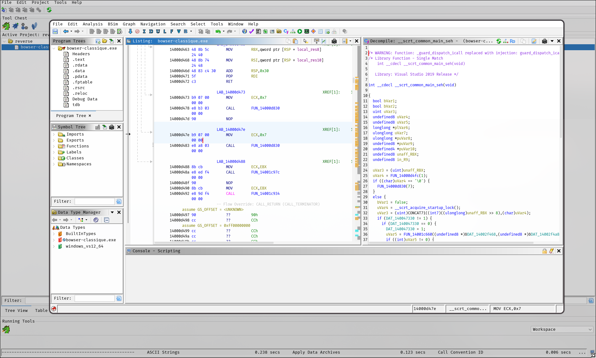
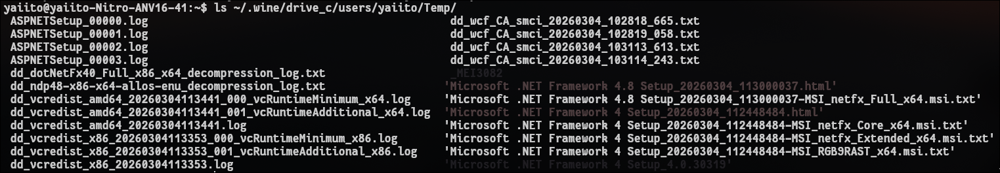
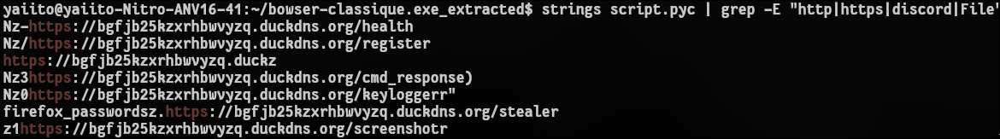
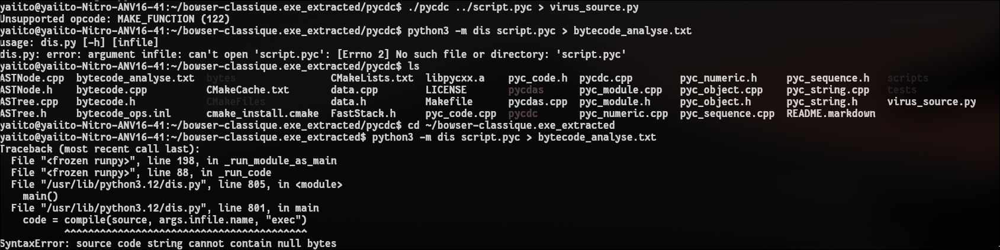

# Rapport d'Analyse Malware : "Bowser-Classique.exe"

**Outils utilisés :**  
Binary Ninja, Ghidra, Wine, PyInstxtractor, Strings, Python Disassembler

---

# 1. Résumé de l'analyse initiale

L'analyse a débuté par une **étude approfondie du code** à l'aide de **Binary Ninja** et **Ghidra**.  

Bien que ces outils aient permis d'observer la structure du fichier, certaines fonctionnalités nepeuvent pas être analyser via c'est outil, nécessitant une transition vers :

- le lancement du site de maniére sécuriser 
- la décompilation spécifique

---

# 2. Identification du vecteur technique

L'exécution sous **Linux (via Wine)** a révélé que le fichier n'était **pas un simple exécutable C++**, mais un **package PyInstaller utilisant Python 3.13**.

### Dépendances requises

L'installation a nécessité :

- **.NET Framework 4.8**
- **Visual C++ Runtime**

### Extraction automatique

Le virus s'est extrait de lui-même dans le répertoire temporaire :

---

# 3. Capacités du Malware (Analyse des modules)

Grâce à l'extraction des bibliothèques incluses dans le binaire, plusieurs fonctionnalités malveillantes ont été identifiées.

### Keylogger

Utilisation de la bibliothèque **pynput** pour capturer les frappes clavier.

### Espionnage visuel

Présence de **PIL (Pillow)** permettant :

- captures d'écran furtives
- surveillance de l'activité utilisateur

### Vol de données 

Utilisation de **win32crypt** pour extraire :

- mots de passe
- cookies de session

Navigateurs ciblés :

- Chrome
- Firefox

### Chiffrement

Utilisation du module **cryptography** pour :

- chiffrer les données volées
- préparer leur exfiltration vers le serveur de l'attaquant
- éventuellement chiffrer des fichiers locaux

---

# 4. Infrastructure Réseau (Command & Control)

L'analyse des **chaînes de caractères (`strings`)** a permis d'identifier l'infrastructure C2.

### Domaine C2

bgfjb25kzxrhbwvyzq.duckdns.org

### Points de terminaison identifiés

| Endpoint | Fonction |
|--------|--------|
| `/register` | Enregistrement de la machine victime |
| `/keyloggerr` | Exfiltration des frappes clavier |
| `/screenshotr` | Envoi des captures d'écran |
| `/firefox_passwords` | Vol d'identifiants Firefox |
| `/cmd_response` | Exécution de commandes à distance (Backdoor) |

---

# 5. Obstacles rencontrés

### Version de Python

Le malware utilise **Python 3.13**, ce qui a rendu la décompilation difficile avec les outils standards comme :

- `pycdc`

Problème rencontré :

- erreurs d'opcodes non supportés

### Environnement Wine

Le malware a présenté des **instabilités lors de l'exécution**, notamment :

- erreurs `OLE`
- erreurs `IRemUnknown`

Ces problèmes peuvent être liés à :

- des mécanismes d'auto-protection
- des incompatibilités avec Wine

---

# 6. Conclusion

Le malware **"Bowser-Classique"** est un **Spyware**.

Malgré un nom pouvant paraître anodin, il possède plusieurs capacités critiques :

- vol de mots de passe
- capture de frappes clavier
- capture d'écran
- communication avec un serveur C2
- exécution de commandes à distance

Ce malware dispose donc de **tous les outils nécessaires pour compromettre des comptes en ligne et surveiller l'activité d'un utilisateur en temps réel.**